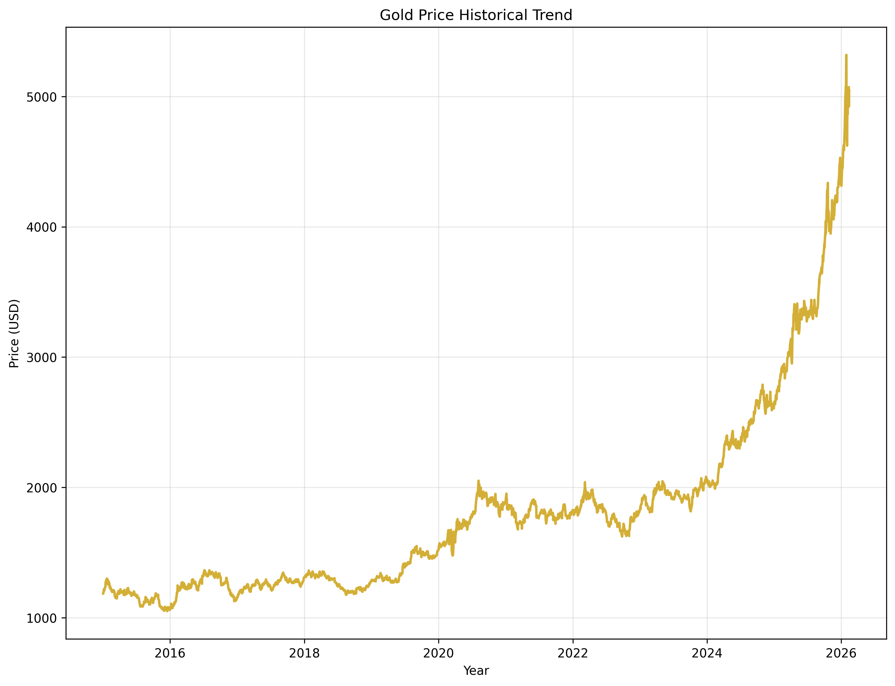
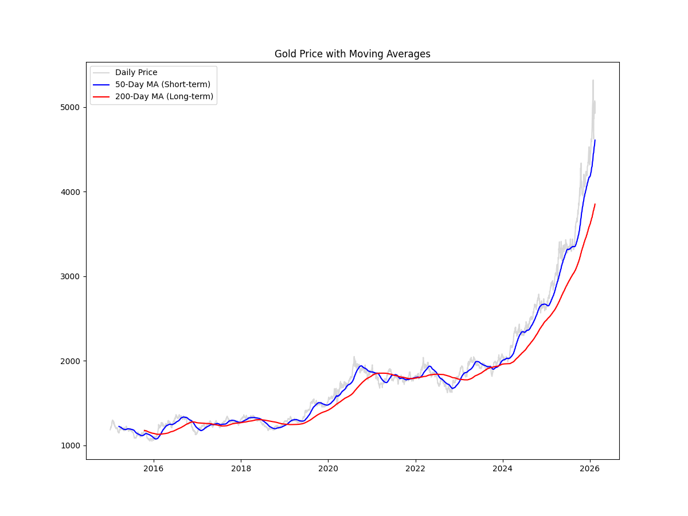
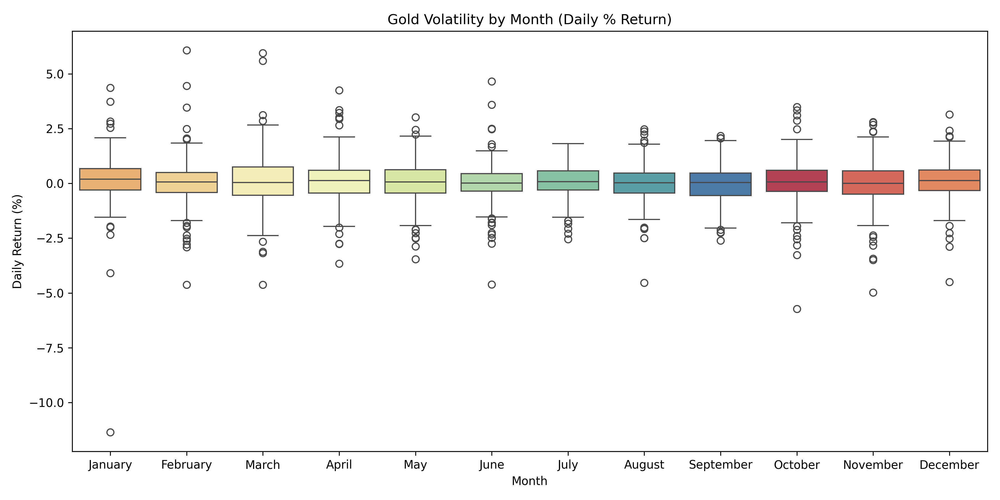
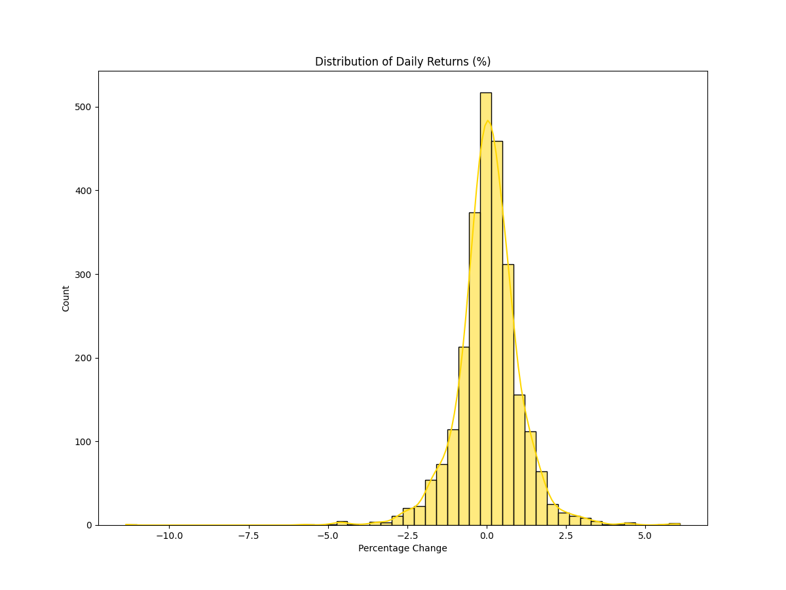
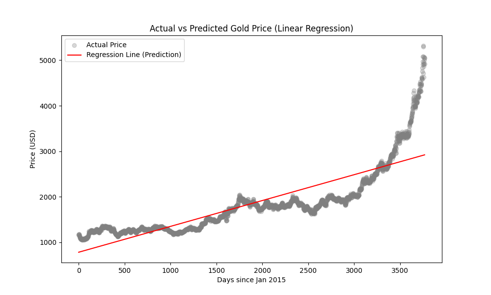

# Gold Price Analysis & Prediction

## Overview

This project analyzes historical gold price data to identify long-term trends, seasonal volatility, and market signals using Moving Averages. It also includes a simple Machine Learning model to predict future price directions.

## Project Structure

- `data/processed/`: Cleaned dataset (`gold_cleaned.csv`).
- `notebooks/`: Jupyter Notebook containing the full EDA and Prediction model.
- `src/`: Python scripts for automated data cleaning.
- `images/`: Saved visualizations for documentation.

## How to Run

1. Install dependencies: `pip install -r requirements.txt`
2. Run data cleaning: `python src/data_cleaning.py`
3. Explore the analysis: Open `notebooks/exploration.ipynb`

## Visualizations & Insights

### 1. Historical Price Trend

- **Long-term Growth**: Identifies the overall upward trajectory of gold, confirming its status as a reliable safe-haven asset for long-term investors.

- **Market Events**: Highlights significant price spikes and drops that correlate with major global economic shifts and geopolitical events.

- **Insight:** Analyzes the long-term growth of gold as a safe-haven asset over the past decade.

### 2. Moving Average Analysis (MA50 vs MA200)

- **Market Momentum**: Detects "Golden Cross" (buy) and "Death Cross" (sell) signals when short-term trends cross long-term averages.

- **Trend Stability**: Evaluates whether the market is in a Bullish or Bearish state based on price positioning relative to the 50-day and 200-day averages.

- **Insight:** Identifies "Golden Cross" and "Death Cross" signals to determine market momentum.

### 3. Monthly Volatility Analysis

- **Seasonal Patterns**: Pinpoints specific months that historically experience the highest price swings, helping investors time their entries.

- **Price Ranges**: Compares median prices across different months to identify seasonal buying opportunities or overvalued periods.

- **Insight:** Uses Box Plots to detect which months typically exhibit the highest price fluctuations.

### 4. Daily Returns Distribution

- **Risk Assessment**: Analyzes the frequency of daily percentage changes to measure the volatility risk associated with holding gold.

- **Statistical Balance:**: Determines if price movements follow a normal distribution (Bell Curve), which indicates predictable market behavior.

- **Insight:** Visualizes the risk profile of gold. A normal distribution suggests stable daily price changes.

### 5. Actual vs. Predicted Price

- **Model Accuracy**: Evaluates how closely the Linear Regression model tracks actual historical movements to validate its predictive power.

- **Future Trajectory**: Uses the regression line ($y = mx + b$) to project the general direction of gold prices based on historical data.

- **Insight:** Evaluates the Linear Regression model performance in tracking actual price movements.
- **Model Equation:** $y = mx + b$
